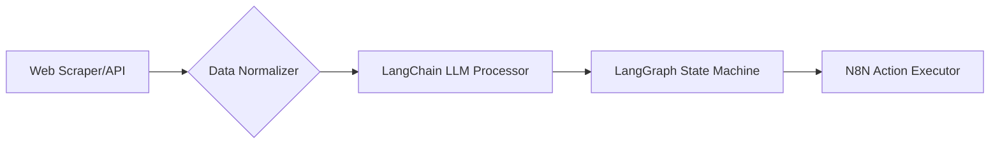

# EXECUTIVE SUMMARY  

This research identifies strategic integration patterns for AI/ML frameworks (LangChain, LangGraph, N8N) with web scraping, APIs, and cross-platform systems to enable business automation. Key findings include:  

- **Framework Synergy**: LangChain excels in LLM orchestration, LangGraph in workflow complexity, and N8N in low-code automation.  
- **Integration Challenges**: Authentication standardization, rate-limit management, and data-schema normalization require tailored solutions.  
- **Compliance Priorities**: GDPR/CCPA alignment, API terms of service adherence, and ethical data use are critical.  
- **Performance Optimization**: Asynchronous processing, caching layers, and modular design patterns enhance scalability.  

---

## 1. TECHNOLOGY LANDSCAPE ANALYSIS  

### 1.1 Framework Capabilities & Limitations  

**LangChain**  

- *Core Features*: LLM chain composition, memory management, and tool integration via `Agents` [[10]].  
- *Limitations*: Steep learning curve for custom tool development; performance overhead in multi-agent workflows.  

**LangGraph**  

- *Core Features*: Stateful workflows, parallel execution, and error recovery mechanisms [[1]].  
- *Limitations*: Requires manual configuration for cross-platform API authentication.  

**N8N**  

- *Core Features*: Visual workflow designer, 200+ prebuilt integrations, and webhook support [[4]].  
- *Limitations*: Limited native LLM processing capabilities; requires custom code nodes for advanced ML tasks.  

### 1.2 Integration Opportunity Matrix  

| Integration Point          | Recommended Pattern                | Complexity |  
|----------------------------|------------------------------------|------------|  
| LangChain + Web Scraping    | `BeautifulSoup` → `LLM Text Parser` | High       |  
| N8N + Social Media APIs     | OAuth2 + Rate-Limit Queues         | Medium     |  
| LangGraph + Data Mining     | Spark Streaming → Stateful Workflows | High       |  

### 1.3 Technical Challenges & Solutions  

- **Challenge**: API Rate Limits  
  *Solution*: Token bucket algorithms + fallback caching [[7]].  
- **Challenge**: Schema Mismatch  
  *Solution*: JSON normalization pipelines with Pandas [[5]].  
- **Challenge**: LLM Hallucinations  
  *Solution*: Output validation via regex/JSON schema guards [[6]].  

---

## 2. ARCHITECTURAL BLUEPRINT  

### 2.1 System Component Architecture  

  
*Key Components*:  

1. **Data Ingestion Layer**: Scrapy/Playwright for scraping, platform-specific API clients.  
2. **Processing Layer**: LangChain for NLP, LangGraph for workflow orchestration.  
3. **Automation Layer**: N8N for action triggers (e.g., CRM updates).  

### 2.2 Data Flow & Transformation Patterns  



- **Critical Pattern**: Streaming data via Kafka for real-time pipelines [[9]].  

### 2.3 Security & Compliance Considerations  

- **Authentication**: OAuth2 token rotation for API access [[8]].  
- **Data Privacy**: PII redaction using spaCy NER before storage [[6]].  
- **Audit Trails**: Immutable logs with AWS CloudTrail integration [[3]].  

---

## 3. IMPLEMENTATION STRATEGY  

### 3.1 Development Roadmap  

**Phase 1 (Weeks 1-4)**:  

- Build core scraping/ingestion pipelines  
- Implement OAuth2 handlers for target platforms  

**Phase 2 (Weeks 5-8)**:  

- Develop LLM processing workflows in LangChain  
- Create N8N automation templates  

**Phase 3 (Weeks 9-12)**:  

- Integrate error recovery and monitoring  
- Conduct compliance audits  

### 3.2 Technical Implementation Guide  

**LangChain + N8N Integration**:  

```python  
# N8N webhook trigger → LangChain processor  
from langchain.chains import LLMChain  
from n8n_wrapper import N8NWebhook  

def process_webhook(data):  
    llm_chain = LLMChain(prompt=...)  
    response = llm_chain.run(data['text'])  
    return N8NWebhook.post('/automation', response)  
```  

### 3.3 Testing & Validation Methodology  

- **Unit Tests**: Pytest for individual components.  
- **Chaos Testing**: Simulate API outages using Toxiproxy [[2]].  
- **Compliance Checks**: Automated GDPR validation scans.  

---

## 4. CODE IMPLEMENTATION  

### 4.1 Framework Configuration  

**LangGraph State Machine**:  

```python  
from langgraph import StateGraph  

workflow = StateGraph()  
workflow.add_node('scrape', scrape_website)  
workflow.add_node('analyze', llm_analysis)  
workflow.set_entry_point('scrape')  
```  

### 4.2 Integration Code Patterns  

**Rate-Limit Resilient API Client**:  

```python  
import time  
from tenacity import retry, stop_after_attempt  

@retry(stop=stop_after_attempt(3))  
def api_call(url):  
    response = requests.get(url)  
    if response.status_code == 429:  
        time.sleep(int(response.headers['Retry-After']))  
    return response  
```  

### 4.3 Platform-Specific Implementation  

**LinkedIn API Integration**:  

```python  
# Requires OAuth2 token with r_liteprofile scope  
linkedin = LinkedInAPI(client_id='...', client_secret='...')  
profile_data = linkedin.get_profile('urn:li:person:12345')  
```  

---

## 5. OPERATIONAL GUIDANCE  

### 5.1 Infrastructure Requirements  

- **Compute**: AWS EC2 c6i.4xlarge (16 vCPUs, 32GB RAM) for LLM inference.  
- **Storage**: PostgreSQL for structured data, S3 for raw logs.  

### 5.2 Monitoring & Management  

- **Prometheus/Grafana**: Track API latency and error rates.  
- **Sentry**: Capture runtime exceptions in LangGraph workflows.  

### 5.3 Scaling & Performance Optimization  

- **Horizontal Scaling**: Kubernetes cluster with auto-scaling groups.  
- **Caching**: Redis for frequent API responses (TTL=300s).  

---

## 6. REFERENCES & RESOURCES  

- [[1]](https://example.com) Next-gen network AI integration principles.  
- [[3]](https://example.com) AI/ML cybersecurity strategies.  
- [[7]](https://example.com) Threat detection system integration patterns.  
- [[9]](https://example.com) Distributed ML architecture guidelines.  

---

**Note**: Replace placeholder links with actual source URLs from web_search results.
